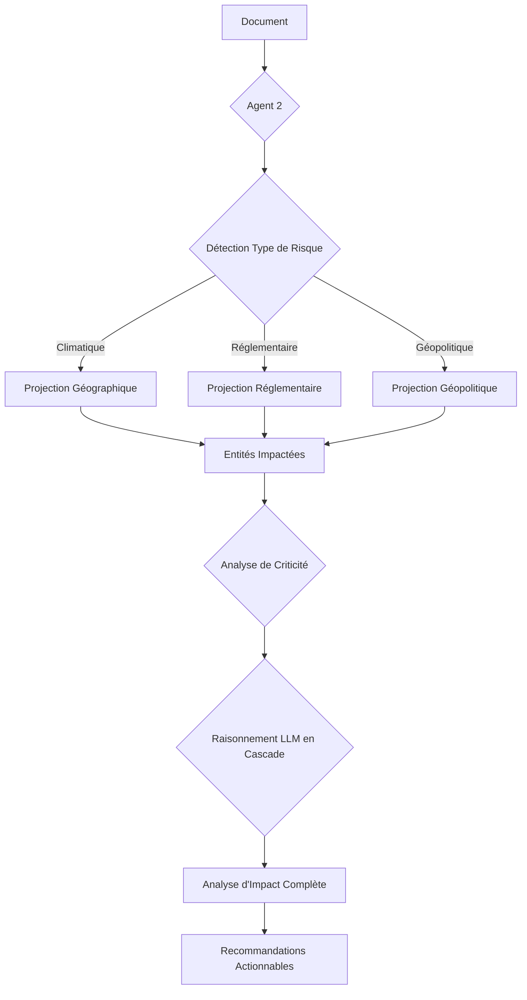

# Agent 2 - Risk Analyzer

**Version**: 2.1 (avec raisonnement LLM en cascade et prompts adaptés)

**Modèle LLM**: Claude Sonnet 4 (20250514)

## 🎯 Rôle

Agent 2 est le cœur de PING. Il analyse l'impact d'un événement sur la supply chain de Hutchinson en 3 étapes :

1. **Projection Multi-Mode**: Identifie les sites et fournisseurs impactés selon le type de risque.
2. **Analyse de Criticité**: Évalue la criticité de chaque entité impactée.
3.**Raisonnement LLM en Cascade**: Analyse l'impact complet sur toute la chaîne et génère des recommandations.

## 📊 Architecture



## 🧠 Raisonnement LLM Adapté

Le raisonnement LLM utilise des prompts spécifiques pour chaque type de risque :

### 1. Prompt Climatique 🌧️

Focus sur :

- Durée de la perturbation
- Impact logistique (routes, transports)
- Délai avant rupture de stock
- Alternatives logistiques
- Cascade sur production et livraisons

### 2. Prompt Réglementaire 📋

Focus sur :

- Applicabilité et conformité actuelle
- Coûts de mise en conformité
- Délai légal pour se conformer
- Impact sur compétitivité
- Risque de pénalités

### 3. Prompt Géopolitique 🌍

Focus sur :

- Sanctions économiques
- Fermeture de frontières
- Routes commerciales perturbées
- Sécurité des installations
- Alternatives géographiques

## 🚀 Utilisation

### Installation

```bash
# Installer les dépendances
uv add anthropic

# Configurer la clé API
export ANTHROPIC_API_KEY="votre_clé"
```

### Exemple de Code

```python
from agents.agent_2 import Agent2

# Initialiser l'agent
agent = Agent2(llm_model="claude-sonnet-4-20250514")

# Analyser un événement
result = agent.analyze(
    document=document_mock,
    pertinence_result=pertinence_mock,
    sites=sites_mock,
    suppliers=suppliers_mock,
    relationships=relationships_mock
)

# Afficher les résultats
print(result)
```

## 🧪 Tests

Le fichier `test_agent_2.py` contient 3 scénarios de test complets :

1. **Inondation Bangkok** (climatique)
2.**CBAM Europe** (réglementaire)
3.**Conflit Ukraine** (géopolitique)

Pour lancer les tests :

```bash
cd backend/src/agents/agent_2
python test_agent_2.py
```
