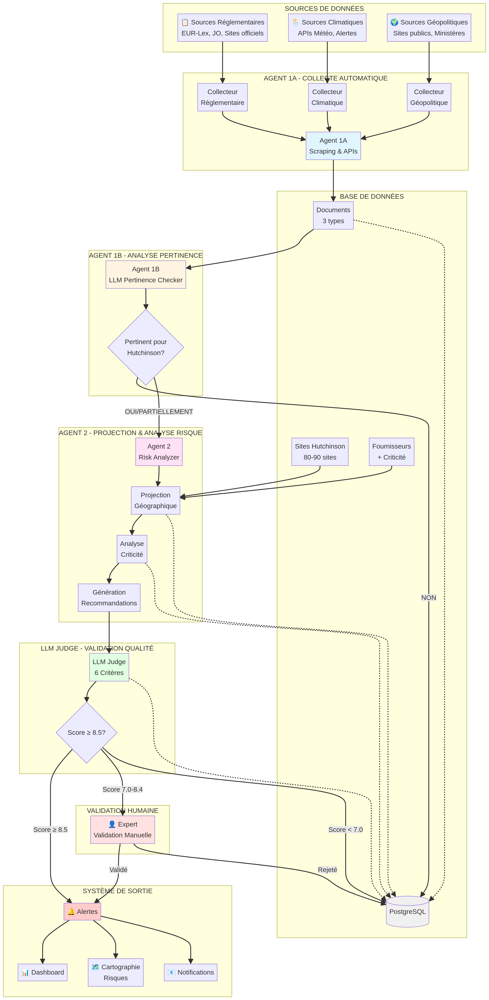
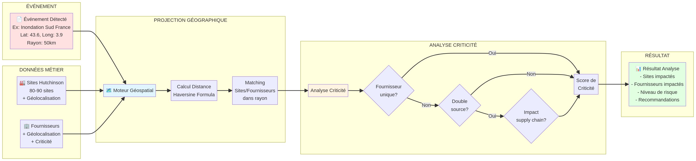
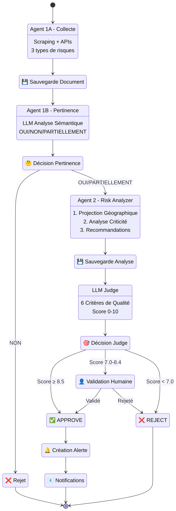

# Architecture Complète du Système PING

**Auteur:** Manus AI
**Date:** 29 Janvier 2026

## 1. Introduction

Ce document présente l'architecture complète du système PING (Plateforme de Veille des Risques Externes) pour Hutchinson. L'objectif est de créer une solution de monitoring des risques de la supply chain en temps réel, similaire à Prewave, mais spécifique aux besoins d'Hutchinson.

## 2. Vision Globale

Le système PING est conçu pour :
- **Collecter automatiquement** les informations sur 3 types de risques : réglementaires, climatiques et géopolitiques.
- **Analyser la pertinence** de ces informations pour Hutchinson.
- **Projeter géographiquement** les risques sur les sites de production et les fournisseurs.
- **Analyser la criticité** de l'impact sur la supply chain.
- **Générer des recommandations** et des alertes.
- **Fournir une interface** pour visualiser les risques et les alertes.

## 3. Diagramme d'Architecture End-to-End

Le diagramme ci-dessous présente le flux complet du système, depuis la collecte des données jusqu'à la notification des utilisateurs.

## 4. Composants de l'Architecture

### 4.1. Sources de Données

Le système collecte des données depuis 3 types de sources :
- **Réglementaires** : EUR-Lex, Journal Officiel, sites gouvernementaux.
- **Climatiques** : APIs météo, alertes de catastrophes naturelles.
- **Géopolitiques** : Sites d'information, ministères, sources publiques.

### 4.2. Agent 1A - Collecte Automatique

L'Agent 1A est responsable de la collecte automatisée des données. Il est composé de 3 sous-agents spécialisés :
- **Collecteur Réglementaire** : Scrape les sites réglementaires.
- **Collecteur Climatique** : Interroge les APIs météo.
- **Collecteur Géopolitique** : Surveille les sources d'information.

### 4.3. Base de Données (PostgreSQL)

La base de données stocke toutes les informations du système :
- **Documents** : Les données brutes collectées par l'Agent 1A.
- **Sites Hutchinson** : La liste des 80-90 sites de production avec leur géolocalisation.
- **Fournisseurs** : La liste des fournisseurs avec leur géolocalisation et leur criticité.

### 4.4. Agent 1B - Analyse de Pertinence

L'Agent 1B utilise un LLM pour analyser la pertinence de chaque document collecté. Il répond à la question : "Est-ce que cette information est pertinente pour Hutchinson ?" (OUI/NON/PARTIELLEMENT).

### 4.5. Agent 2 - Projection & Analyse de Risque

C'est le cœur du système. L'Agent 2 est responsable de :
- **Projection Géographique** : Croise la localisation de l'événement avec les sites et fournisseurs.
- **Analyse de Criticité** : Évalue l'impact sur la supply chain (fournisseur unique, double-source, etc.).
- **Génération de Recommandations** : Propose des actions à entreprendre.

### 4.6. LLM Judge - Validation Qualité

Le LLM Judge évalue la qualité de l'analyse de l'Agent 2 sur 6 critères et donne un score de 0 à 10.

### 4.7. Validation Humaine

Si le score du Judge est entre 7.0 et 8.4, un expert humain doit valider l'analyse.

### 4.8. Système de Sortie

Le système génère :
- **Alertes** : Notifications en temps réel.
- **Dashboard** : Vue d'ensemble des risques.
- **Cartographie** : Visualisation des risques sur une carte.
- **Notifications** : Emails ou autres notifications.

## 5. Zoom sur la Projection Géographique

Le diagramme ci-dessous détaille le fonctionnement de la projection géographique.

## 6. Flux LangGraph Détaillé

Le diagramme ci-dessous présente le flux d'exécution des agents orchestré par LangGraph.

## 7. Prochaines Étapes

1. **Définir le modèle de données** complet.
2. **Prioriser les fonctionnalités** pour le livrable de février.
3. **Commencer le développement** du backend (Agents + LangGraph).
